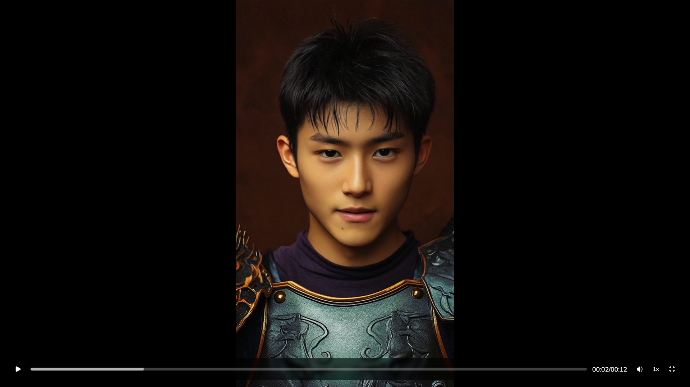

# Winston's AI Agent for Math & News
🎓 **五年級明水研究專題成果**

這是一個由台灣五年級學生 Winston 所設計與實作的 AI 學習助理，作為「明水研究」課程的一部分。這個 AI Agent 能幫助小學生自主學習、練習數學，並了解每天的世界新聞。

## ✨ 主要功能
- 📰 根據分類（科技、健康、科學...）提供新聞摘要（使用 GNews API）
- 🧠 根據課本資料出國小數學練習題、判斷答案是否正確，並給予解說（使用 GPT-4）
- 🔊 使用 OpenAI TTS 將新聞與題目朗讀出來
- 🤖 擁有可互動的虛擬人圖像介面（會張嘴說話）

## 🛠️ 使用技術
- 後端框架：Flask (Python)
- 語言模型：OpenAI GPT-4 / TTS
- 資料來源：GNews API、CSV 題庫
- 前端呈現：HTML + JavaScript + CSS + 虛擬人動畫
- 部署平台：Render

## 🚀 安裝與部署（開發者使用）
```bash
git clone https://github.com/your-account/your-repo.git
cd your-repo
pip install -r requirements.txt
python app.py
```

### 📌 需要設定的環境變數（部署在 Render 時需設定）
- `OPENAI_API_KEY`：你的 OpenAI API 金鑰
- `GNEWS_API_KEY`：你的 GNews API 金鑰

## 📷 預覽畫面


## 👦 開發者
- Winston（台灣五年級學生）

---
> 本專案為小學生個人研究與實作成果，展現 AI 技術在教育領域的創新應用。
